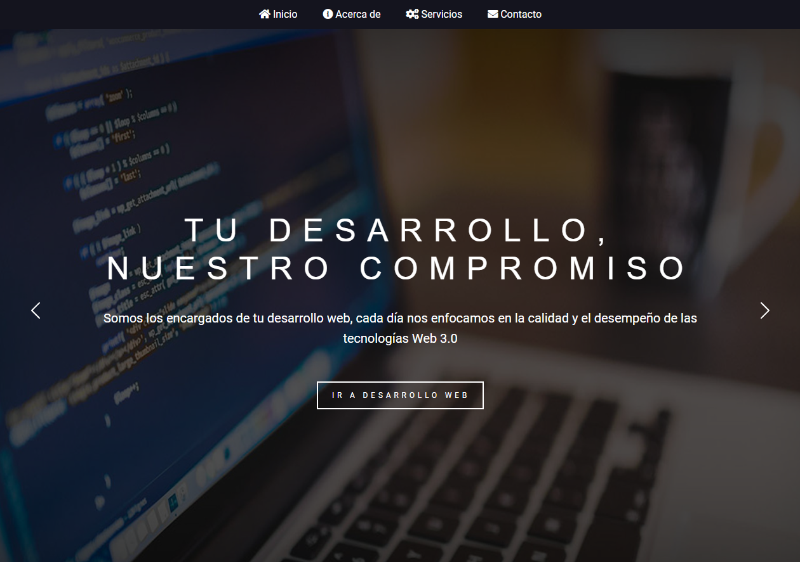

<!-- Trabajo Práctico Desarrollo Web HTML, CSS y JavaScript. Full Stack Python - Comisión 24150, CaC. -->

# WebTechSoluciones - Documentación Técnica

WebTechSoluciones es un sitio web que ofrece servicios de desarrollo web, almacenamiento de datos, soporte IT y servicios de servidores. Aquí está la documentación técnica clave para comprender su funcionamiento y estructura, incluyendo su validación por [https://validator.w3.org/](https://validator.w3.org/).

## Estructura del Proyecto
El proyecto sigue una estructura básica de HTML, CSS y JavaScript. Los archivos se organizan en diferentes directorios para una mejor gestión:

- **assets/:** Contiene archivos multimedia (imágenes, íconos, etc.) y recursos de estilo y script.
- **assets/css/:** Estilos CSS utilizados en todo el sitio.
- **assets/js/:** Scripts JavaScript utilizados para funcionalidades interactivas.
- **assets/multimedia/:** Contiene imágenes utilizadas en el sitio.
- **pages/:** Páginas HTML individuales para Inicio, Acerca de, Servicios y Contacto.

## Funcionalidades Clave
- **Slideshow:** Implementado con JavaScript y CSS para mostrar los servicios destacados en la página principal.
- **Formulario de Contacto:** Permite a los usuarios enviar consultas o comentarios mediante un formulario HTML y se procesa con JavaScript.
- **Responsive:** El sitio está diseñado para adaptarse y ser accesible en una variedad de dispositivos y tamaños de pantalla.

## Validación W3C
El sitio web ha sido validado por [https://validator.w3.org/](https://validator.w3.org/), lo que garantiza que el código HTML cumple con los estándares establecidos por el Consorcio World Wide Web (W3C) para la accesibilidad y la interoperabilidad web.

## Tecnologías Utilizadas
- **HTML5:** Utilizado para la estructura y el contenido de las páginas.
- **CSS3:** Estilos aplicados para mejorar la apariencia y la usabilidad del sitio, incluyendo su capacidad de ser responsive.
- **JavaScript:** Scripts utilizados para funcionalidades interactivas como el slideshow y el formulario de contacto.

## Colaboradores
- **Angel Farina**
- **Diego Capdevila**
- **Jeremías Geminiani**
- **Arturo Villagran**

## Muestra

Esta documentación técnica proporciona una visión detallada de la estructura, las funcionalidades, las tecnologías utilizadas y la validación por W3C del proyecto de WebTechSoluciones.
